# 핸즈온 준비 단계 입니다. (Hands-on Prerequisite)

# 1. 이벤트 엔진 접속 (Event Engine Access)
- 이벤트 엔진으로 접속이 아닐시에는 "2. SageMaker 노트북 생성 (Create SageMaker Notebook)" 에서 시작 해주세요. (Skip this section if you don't use the event engine)
- **이벤트 엔진( https://dashboard.eventengine.run )에 접속**을 하시고, 받으신 해시 코드를 입력해주세요. (Connect to the event engine and enter the hashcode given)

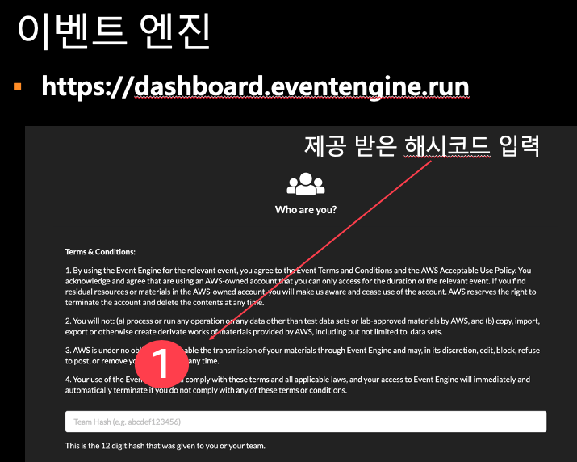

- 로그인 이후에 아래 "AWS Console"을 클릭 합니다. (Click AWS Console)
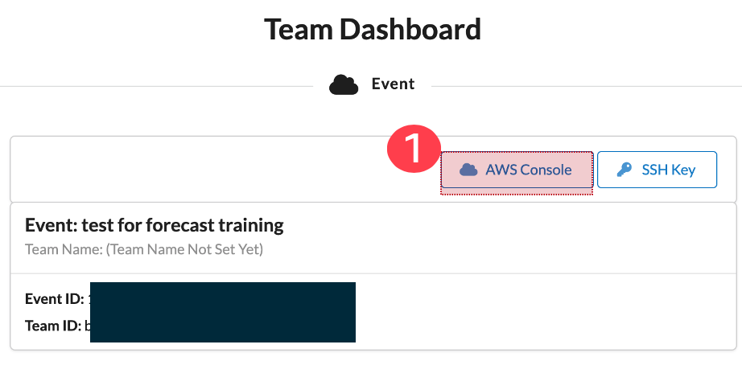

- AWS Console Login 이후에 "Open AWS Console"을 클릭 하세요. (Click "Open AWSConsole")
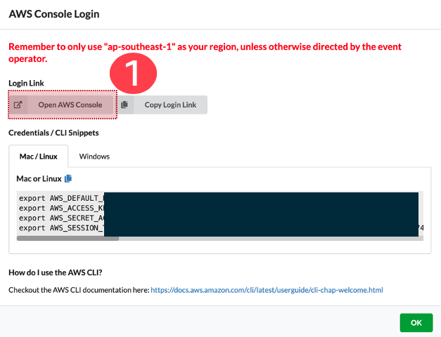

# 2. SageMaker 노트북 생성 (Create SageMaker Notebook)

- SageMaker Console로 이동 하세요. 아래와 같이 "Services"를 클릭하고, 이후에 Sage 입력하면 아래에 Amazon SageMaker가 보입니다. 이를 클릭 해주세요. (Go to sagemaker console, click Services, then type SageMaker, finally click SageMaker below)

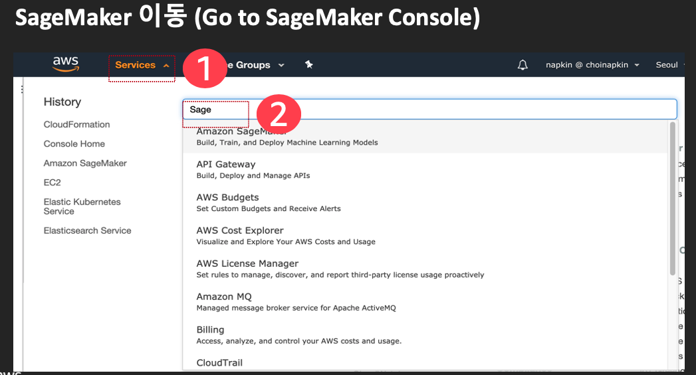

- 노트북 인스턴스를 생성 합니다. 아래와 같이 (1) Notebook Instance를 클릭 합니다. (2) 오른족에 "Create Notebook Instance"를 클릭 합니다. (Click (1) Notebook Instance and then do (2) Create Notebook Instance) 

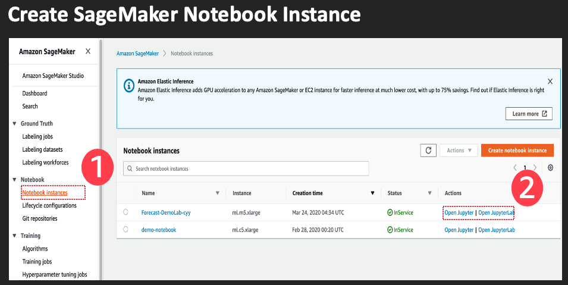

- 노트북의 설정 정보를 입력 합니다. (1) 노트북 이름을 적어 주세요. (예: Forecast-HongGilDong) (2) Permission and encryption에서 IAM role의 리스트 박스를 클릭 해주세요. (3) "Create a new role"을 클릭 해주세요.

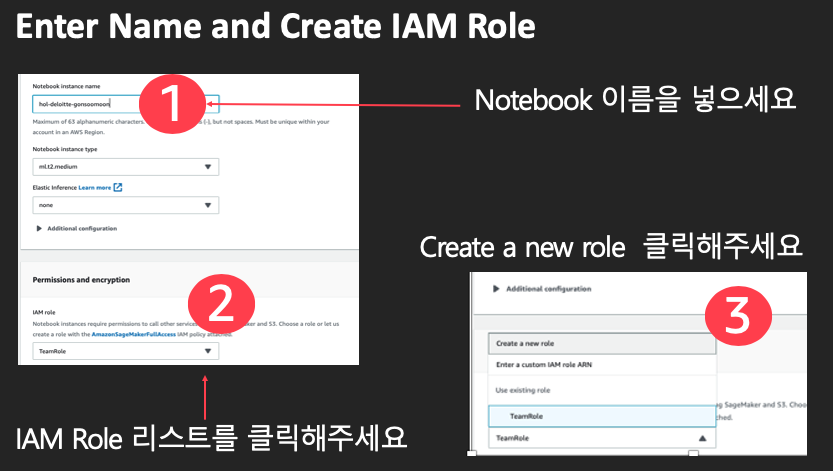

- Any S3 Bucket이 선택이 되었는지 확인 합니다. 이후에 "Create Role"을 클릭 하세요.

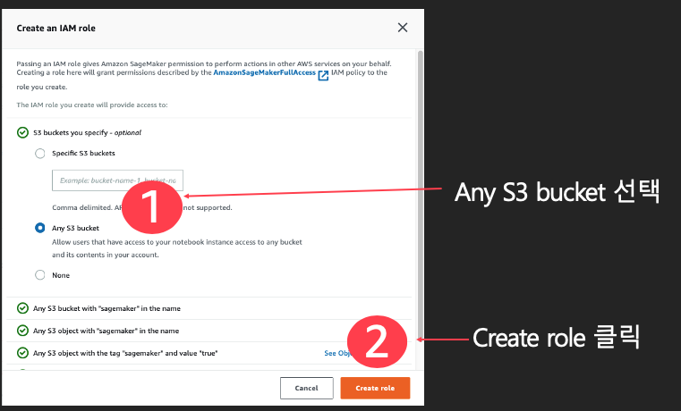

- "Create Notebook Instance"를 클릭 하세요.

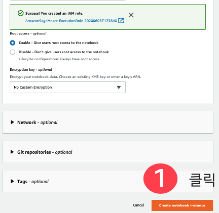

- InService가 될때가지 기다려 주세요.

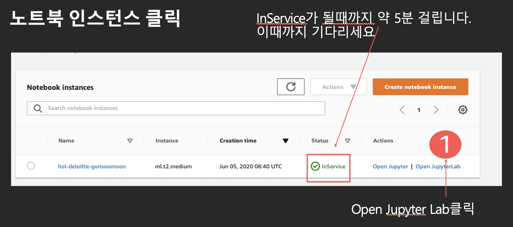

# 4. Download Git Repository

- 소스가 있는 Git Repository를 복사하기 위해서, 상단 메뉴의 Git을 클릭하고, 이어서 "Open Terminal in Git Repository"를 클릭 해주세요.

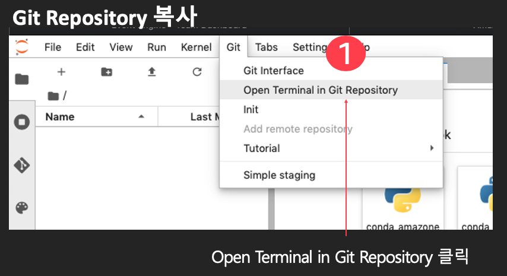

## 4-1 Git Repository 주소 
필요시 아래의 Git Repository를 Clone 해주세요

- Hands On Lab: 이탈 고객 학습 및 추론
    - https://github.com/gonsoomoon-ml/churn-prediction-workshop

    
- Hands On Lab: TensorFlow 2 프로젝트 워크플로우를 SageMaker에서 실행
    - https://github.com/mullue/sm-tf2
    
## 4-2 Git Repository 다운로드 (필요한 것만 다운로드 해주세요.)

- 아래 화면 처럼 입력 해주시고, 오른쪽에 두개의 폴더가 생성되었는지 확인 해주세요.
    - 간단하게 아래를 순서대로 카피 하시고 (Control-v 혹은 Cmd-v) 하시고 붙여넣기 (Control-v) 하시면 됩니다.
    - cd SageMaker
    - git clone https://github.com/gonsoomoon-ml/churn-prediction-workshop
    - git clone https://github.com/mullue/sm-tf2

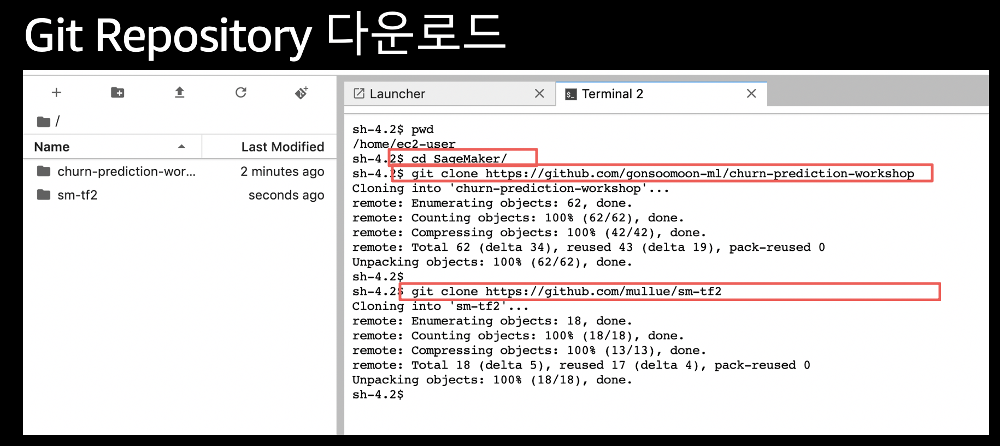

# 준비 완료 (Get Ready)

- 핸즈온의 준비가 완료 되었습니다. 만일 이 과정이 완료가 안되었으면 진행자에게 알려 주세요.